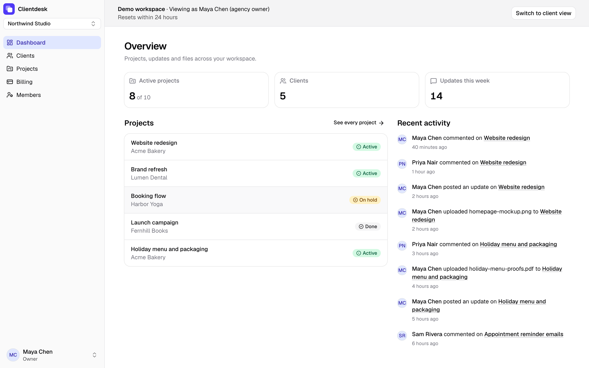
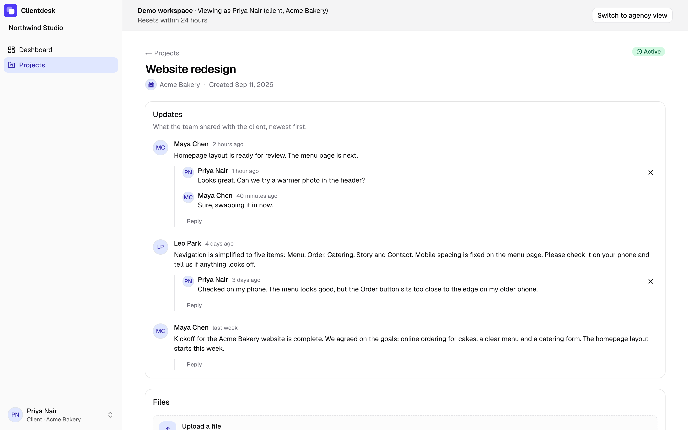

# Clientdesk

Clientdesk is a client portal for small agencies and freelancers. The agency posts project updates and files, and each client sees only their own projects and can comment on them.

## Live demo

https://clientdesk-app.vercel.app

On the landing page, "Try as agency" and "Try as client" each open a private copy of a sample agency, signed in, with no password. A banner at the top switches between the two roles. The copy expires after 24 hours and a daily cleanup deletes it.

To see billing, open the billing page and follow the link to the Free workspace "Northwind Labs". Upgrade there runs a Stripe test checkout: use the card `4242 4242 4242 4242`, any future expiry and any CVC.





## What it does

- Workspaces with an owner, members and clients. Staff manage clients and projects; a client sees only the projects of their own company. Staff can rename a client, delete a client that has no projects and no people, and delete a project.
- Projects with updates, comments and file uploads.
- AI update drafts: on a Pro workspace, staff click "Draft update" and Claude writes a client update from the last 7 days of activity. The text streams into the form and is edited before posting.
- Billing through Stripe Checkout and the Customer Portal. Free allows 2 clients; Pro removes the limit and unlocks AI drafts.
- Invites by email, or by a link to copy when no email provider is configured.
- Light and dark themes.
- A private demo sandbox for every visitor.

## Stack

- Next.js 16, React 19, TypeScript, Tailwind CSS 4
- Supabase: Postgres with row level security, Auth and Storage
- Stripe: Checkout, Customer Portal and webhooks, in test mode
- Anthropic API with `claude-haiku-4-5-20251001`
- Vitest, pgTAP and Playwright
- Vercel and Supabase Cloud

## How it is built

- Access rules live in Postgres. Every read goes through row level security, so a client only sees their own projects and the activity on them. pgTAP tests cover the policies.
- A client with projects or people cannot be deleted. Foreign keys enforce that, and the app explains what to remove first. Deleting a client frees a Free plan slot at once.
- Deleting a project removes its Storage objects first and then the row, which takes the updates, comments and file rows with it. AI draft request rows stay, with no project, so deleting a project does not reset the draft limits. If Storage fails halfway the project stays and a retry finishes. A file uploaded in the moment between the listing and the delete is left in Storage with no row.
- Limits are enforced in the database: the Free plan's 2 clients, AI draft claims per user and per workspace, and the caps on demo sandboxes, their drafts and their uploads.
- A demo click creates four users through the Supabase admin API, clones the template workspace in one SQL function and signs the visitor in on the server with a one-time magic-link token. A daily cron deletes expired sandboxes with their users, files and Stripe test customers.
- Stripe is the source of truth for plan state. The webhook, the post-checkout redirect and the owner's Resync button all re-read the subscription from Stripe.
- Stripe, the Anthropic key and the email provider are optional. Without one, its feature says it is not configured, and CI runs without any of them.

The sections below go into each part.

## Run it locally

Prerequisites: Node 24, pnpm 12, Docker (for the local Supabase stack).

```bash
pnpm install
pnpm supabase start        # starts the local Supabase stack in Docker
cp .env.example .env.local # NEXT_PUBLIC_SITE_URL defaults to localhost:3000; fill the
                            # Supabase values from `pnpm supabase status`
pnpm dev                   # http://localhost:3000
```

## Demo sandboxes

`supabase db reset` loads the Northwind Studio template from `supabase/demo/template.sql`: 5 clients and 10 projects on the Pro plan, with updates, comments and files. Nobody signs in to the template itself. "Try as agency" and "Try as client" on the landing page copy it into a private sandbox with fresh users and sign you in without a password. A sandbox lasts 24 hours.

### Setup

After `supabase db reset`, upload the template blobs to local Storage:

```bash
pnpm demo:blobs
```

### Signing in

Each click creates four users (agency owner, member and two clients) through the Supabase admin API, then signs you in on the server with a one-time magic-link token. No password is shown or stored anywhere. The users get addresses on `demo.clientdesk.invalid`. A banner at the top of the workspace says who you are and switches between the agency owner and a client. Sandboxes never see each other's projects, comments or files.

### Limits and cleanup

A visitor can start 3 sandboxes per hour, counted by a salted hash of their IP address; the raw address is never stored. Across all visitors the limit is 40 new sandboxes per hour and 300 live ones. `GET /api/cron/cleanup-demo` with `Authorization: Bearer $CRON_SECRET` deletes expired sandboxes with their users, Storage files and Stripe test customers, plus AI draft request rows older than 7 days. A sandbox's record is removed only after all of that is gone, so anything that failed is retried on the next run, and demo users no sandbox owns are swept after 25 hours. `vercel.json` runs it once a day at 04:00 UTC; `docs/deploy.md` covers the setup.

### Mail and invites in a sandbox

No email leaves a sandbox: the app drops every recipient on `demo.clientdesk.invalid`, and invites are turned off there with a note that says so. Outside a sandbox, when no email provider is configured, the invite dialog shows the invite link to copy.

### Limits in a sandbox

AI drafts: a sandbox gets 3 drafts total, and all sandboxes together share a rolling 24-hour budget of 150 drafts. Past either limit, the visitor sees a message that explains the limit and a saved sample draft to edit and publish.

Uploads: a sandbox registers at most 5 uploaded files over its life (deleting a file frees no slot), 2 MB each, images (PNG, JPEG, WebP, GIF) or PDF. The type limit trusts the Content-Type that Storage recorded; the bytes are not sniffed. A visitor can still upload objects straight to Storage without registering them and delete them again; those are not counted in the 5, and are bounded only by a cap on objects per workspace at any moment, 10 MiB each, and the 24-hour life of the sandbox. After the sandbox expires all of its files are deleted.

Billing: the sandbox's Pro workspace is pinned to Pro and links to a Free workspace called "Northwind Labs" where a visitor can run a real Stripe test-mode checkout with the test card 4242 4242 4242 4242.

### Environment variables

Sandboxes need `SUPABASE_SECRET_KEY` for the admin API. Production also needs `DEMO_VISITOR_SALT`, a random string for the visitor hash; without it the demo buttons answer that the live demo isn't available. Locally the salt can stay empty. `CRON_SECRET` is the token the cleanup route expects; without it the route refuses every request.

### Test fixtures

The test fixtures (Acme Agency) are a separate workspace. The e2e specs `e2e/demo-data.spec.ts`, `e2e/visual-polish.spec.ts` and `e2e/destructive-contrast.spec.ts` sign in to Northwind Studio through the demo button.

## Billing (Stripe test mode)

Billing is optional. Without `STRIPE_SECRET_KEY`, `STRIPE_WEBHOOK_SECRET`, `STRIPE_PRO_PRICE_ID` and `SUPABASE_SECRET_KEY`, the billing page shows "Billing is not configured" and CI runs without them.

### Setup

Install Stripe CLI 1.52 or later. Log in to your Stripe test account:

```bash
stripe login
```

Create the Pro product and price:

```bash
stripe products create --name "Clientdesk Pro"
stripe prices create --product <prod_id> --unit-amount 1900 --currency usd -d "recurring[interval]=month"
```

Enable the Customer Portal in the Stripe sandbox: Settings → Billing → Customer portal, allow cancellations.

Get your keys:

```bash
pnpm supabase status          # copy SECRET_KEY to SUPABASE_SECRET_KEY
stripe listen --print-secret  # copy to STRIPE_WEBHOOK_SECRET
```

Add `STRIPE_SECRET_KEY`, `STRIPE_WEBHOOK_SECRET`, `STRIPE_PRO_PRICE_ID` and `SUPABASE_SECRET_KEY` to `.env.local`.

### Webhook forwarding

Forward Stripe events to your local server (required for testing):

```bash
stripe listen --events checkout.session.completed,customer.subscription.created,customer.subscription.updated,customer.subscription.deleted,customer.subscription.paused,customer.subscription.resumed,invoice.paid,invoice.payment_failed --forward-to localhost:3000/api/stripe/webhook
```

### Test mode

Use card `4242 4242 4242 4242`, any future expiry, any CVC.

Plan state: Stripe is the source of truth. The webhook, the post-checkout redirect and the owner's Resync button all re-read the subscription from Stripe. Free allows 2 clients (enforced in the database). Pro is active, trialing or past_due.

To end a test subscription immediately:

```bash
stripe subscriptions cancel <sub_id> --confirm
```

## AI update draft

Staff on a Pro workspace can click "Draft update" on a project page. The server collects the project's activity from the last 7 days (updates, comments and file names), asks Claude for a short client update and streams the text into the update form. The staff member edits it and posts it like any other update. Free workspaces see an upgrade prompt instead.

Drafts use `claude-haiku-4-5-20251001` with `max_tokens` 800. `claim_ai_draft` in Postgres allows 10 drafts per user per hour and 50 per workspace per 24 hours. The input is capped at 50 items or 12,000 characters, whichever comes first, to keep the cost of one request bounded. Sandboxes are capped at 3 drafts each and share a global daily budget.

`ANTHROPIC_API_KEY` is optional. Locally and in CI, an empty key switches to a fake generator that streams a template draft. In production, an empty key disables the button with "AI drafting is not configured".

### Setup

To try drafting with the real Claude API:

1. Create an API key in the Anthropic Console and add it to `.env.local`:

```bash
ANTHROPIC_API_KEY=sk-...
```

2. Restart the dev server.

`pnpm test:e2e` always uses the fake generator: it starts its own dev server on port 3100 with `ANTHROPIC_API_KEY` and the Stripe keys forced empty, regardless of what's in `.env.local` or whether a dev server is already running on port 3000.

### Local testing

The seed creates a Pro workspace for this feature: `ai-draft-pro-agency`, owner `ai-draft-owner@clientdesk.test`, password `password123`. Sign in, open a project with recent activity and click "Draft update" in the Updates card.

Each run of `e2e/ai-draft.spec.ts` counts against that workspace's limit of 50 drafts per 24 hours, but Playwright's global setup clears that workspace's `ai_draft_requests` rows before the suite runs, so reruns can't exhaust the limit.

## Dashboard, empty and loading states

The workspace dashboard shows active projects, clients and updates from the last 7 days, the five newest projects and a feed of recent updates, comments and file uploads. Every read goes through RLS, so a client only sees their own projects and the activity on them. Lists without data show an empty state that says what goes there and links to the next step (for example, "Add a client first" on Projects). Each route under a workspace has a loading skeleton that matches its layout.

## Landing page

The home page explains the product and leads to sign up or log in. It has a sticky header with a skip link, a hero with a product preview, four feature rows (roles and access, files and conversation, AI update drafts, billing), a three-step "How it works", a closing call to action and a footer. Signed-in visitors are still redirected to their workspace.

The previews are built from the app's own components on sample data, so they follow the theme and need no screenshots. They are decorative: each frame has `aria-hidden="true"` and `inert`, so it adds no links or tab stops. Sections fade in on scroll with a CSS-only `animation-timeline: view()`. Browsers without support and visitors who prefer reduced motion get the static page.

## Theming

The app supports light, dark and system (the default). Inside a workspace, pick a theme from the Account menu at the bottom of the sidebar. Outside a workspace (sign-in, sign-up, onboarding, invite), use the Theme button at the top of the page. The choice is stored in `localStorage` and survives a reload; on system, it follows the OS/browser color scheme.

Color tokens live in `src/app/globals.css` as CSS custom properties (`--background`, `--sidebar`, `--ring`, and so on), each with a light and a dark value. Spacing uses Tailwind's default scale, not custom tokens. New UI should read the color tokens through the Tailwind classes already in use (`bg-background`, `text-foreground`, etc.) rather than hardcoding colors.

## Brand

The logo is an indigo rounded square with two offset white cards (the agency and the client).

- `src/app/icon.svg`: the tab icon in modern browsers
- `src/app/apple-icon.tsx`: the iOS home-screen icon, a 180×180 PNG rendered with `ImageResponse`
- `src/app/favicon.ico`: 16 and 32 px frames for older browsers
- `src/app/opengraph-image.tsx` and `twitter-image.tsx`: the 1200×630 social preview

After changing the mark, rebuild the ICO:

```bash
pnpm icons:favicon
```

`metadataBase` in the root layout reads `NEXT_PUBLIC_SITE_URL`, which makes the social image URL absolute; on a Vercel preview deployment it uses the branch URL instead. Social platforms need that to fetch it.

## Tests

```bash
pnpm lint
pnpm typecheck
pnpm test              # unit tests (Vitest)
pnpm supabase db reset # reapply migrations + seed
pnpm db:test           # pgTAP tests (access control, RPCs)
pnpm test:e2e          # Playwright, requires Supabase running; starts its own dev server on port 3100
pnpm build
```

`pnpm test:e2e` also covers:

- accessibility: axe against WCAG 2 A/AA plus landmark and heading rules (a single top-level `<main>`, one `<h1>`, unique landmarks) on every main route, in both light and dark
- empty states: a new workspace's dashboard, projects, clients, members and project page each explain themselves and offer the next action
- accessibility and 375px layout of the empty screens, a filled project page and the populated dashboard
- layout at a 375px viewport: no horizontal scroll, dialogs fit the viewport, touch targets are at least 44x44
- interaction polish: pointer cursor on enabled controls, no animation under `prefers-reduced-motion`
- landing page: `e2e/landing.spec.ts` tests link roles, CTAs and anchors, skip link, focus outline and border contrast, reduced motion, and shadow rendering; axe WCAG 2 AA on `/` in both light and dark; no horizontal scroll on `/` at 320, 375, 768 and 1024 px; Lighthouse Accessibility, Best Practices and SEO all 100 on desktop and mobile
- brand: `e2e/brand.spec.ts` tests the SVG icon, favicon.ico with 16 and 32 px frames, Apple icon at 180x180, and social preview metadata including absolute image URLs
- demo sandbox: `e2e/demo-sandbox.spec.ts` tests that both landing buttons land signed in, the banner switches roles, and two sandboxes don't see each other's data
- demo invites: `e2e/demo-invites.spec.ts` tests that the Invite button is disabled in a sandbox, with its note
- invite link: `e2e/invite-link.spec.ts` tests that the invite dialog shows a copyable link when no email provider is configured
- demo workspace: `e2e/demo-data.spec.ts` tests that the demo owner sees 10 projects and 5 clients in Northwind Studio, a demo client sees only their own projects, and test fixture owners don't see the demo workspace
- visual polish: `e2e/visual-polish.spec.ts` checks 44px touch targets on phone, unchanged control sizes on desktop, the file and member rows, the backdrop on login and not-found, the sidebar footer and account menu, and the dashboard metrics
- destructive contrast: `e2e/destructive-contrast.spec.ts` checks that destructive buttons keep 4.5:1 text contrast at rest and on hover, in light and dark
- pgTAP demo sandbox: `supabase/tests/21_demo_template_test.sql` tests the template: counts, passwordless users with identities, and the pinned Pro plan
- pgTAP sandbox limits: `supabase/tests/22_demo_sandbox_test.sql` tests clone counts, re-anchored timestamps, sandbox isolation, grants, the three caps and expiry
- pgTAP demo hardening: `supabase/tests/23_demo_hardening_test.sql` tests that demo users cannot create workspaces, invite others, or change their email or phone
- pgTAP demo AI limits: `supabase/tests/24_demo_ai_limits_test.sql` tests the per-sandbox and global daily budget limits on AI drafts, and the ledger that counts them
- pgTAP demo upload limits: `supabase/tests/25_demo_upload_limits_test.sql` tests file count, size and type limits, the ledger that survives file deletion, and the storage policy cap
- pgTAP demo usage cleanup: `supabase/tests/26_demo_usage_cleanup_test.sql` tests the cleanup functions, the demo usage ledgers and the helper RPCs
- demo limits: `e2e/demo-limits.spec.ts` tests the AI draft limit with a sample, upload limits with PNG, oversized, and type refusal, and the storage cap
- client management: `e2e/client-manage.spec.ts` tests renaming a client, deleting an empty one with the Free slot coming back, the explanation for a client with projects or people, and focus after each dialog
- project deletion: `e2e/project-delete.spec.ts` tests the typed-name confirmation, that the project's Storage objects are gone afterwards (including one with no file row), and that a client user has no Delete project button
- pgTAP clients and projects: `supabase/tests/02_clients_test.sql` and `03_projects_test.sql` test who may rename and delete, that projects and people block a client delete, and that a project's updates, comments, files and draft requests go with it
- demo billing: `e2e/demo-billing.spec.ts` tests that the Pro sandbox notes itself and links to its Free workspace for test checkout

## Deploy

The live site runs on Vercel (Hobby) and Supabase Cloud (free plan). [docs/deploy.md](docs/deploy.md) goes through the setup step by step: the Supabase project, migrations, the demo template, auth settings, the Stripe webhook, environment variables, the cron and a smoke test.
